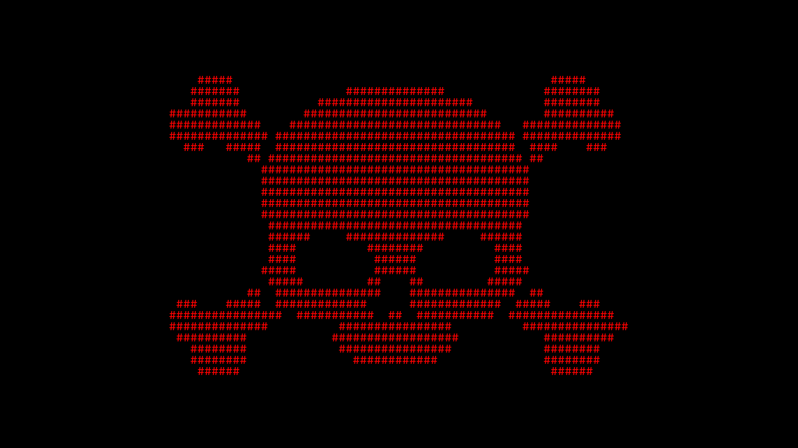

<h1 align="center">Don't-Cry Ransomware PoC</h1>
  
<div align="center">

  
  
  = 1.87.0">
  
  
</div>


PoC ransomware written in Python 💀💀💀

## Usage
* Open the [`DCry.py`](src/DCry.py) file.
* Replace the `YOUR_URL` variable with the encoded URL using the `dx42` function like this:
  ```python
  YOUR_URL = dx42(b"YOUR_ENCODED_URL").decode()
  ```
  (Use the `ex42` function from the `edx42` module to encode your URL first.)
  
  Example:
  ```python
  encoded_url = ex42(b"https://your-tor-server.onion")
  YOUR_URL = dx42(encoded_url).decode()
  ```
* Replace the `YOUR_PROXY` variable similarly with your encoded proxy string:
  ```python
  YOUR_PROXY = dx42(b"YOUR_ENCODED_PROXY").decode()
  ```
* Replace `YOUR_BITCOIN_ADDRESS` with your actual Bitcoin address string.
* Replace `YOUR_EMAIL_ADDRESS` similarly with your encoded email address. 
  ```python 
  YOUR_EMAIL_ADDRESS = dx42(b"YOUR_ENCODED_EMAIL_ADDRESS").decode()   
  ```
* Set `dev_mode = False` to disable development mode.
* Open the [`Decryptor.py`](src/Decryptor.py) file.
* Set `dev_mode = False` to disable development mode.
* Install the required packages with the following command:
  ```bash
  pip install -r requirements.txt
  ```
* Build the Cython code with the following command:
  ```bash
  python src/setup.py build_ext --inplace
  ```
* Run the server with the following command:
  ```bash
  python src/Server.py
  ```
* Run the ransomware with the following command:
  ```bash
  python src/DCry.py
  ```
* Run the decryptor with the following command:
  ```bash
  python src/Decryptor.py
  ```

## Warning
> \[!WARNING]
> This project is a ransomware simulation for educational purposes only.

## FnA  
* See details in [FnA.md](docs/FnA.md)

## Contributing  
* See contribution guidelines in [CONTRIBUTING.md](docs/CONTRIBUTING.md)

## Code Of Conduct  
* See our community standards in [CODE_OF_CONDUCT.md](docs/CODE_OF_CONDUCT.md)

## SECURITY  
* See the security policy in [SECURITY.md](docs/SECURITY.md)


## License
* This project is licensed under the terms of the [Apache License 2.0](./LICENSE).
